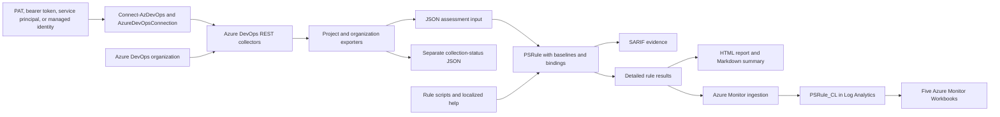
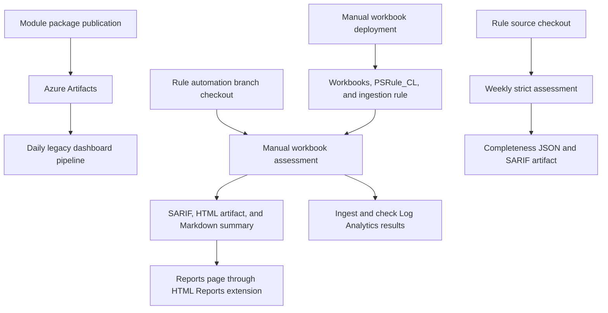

# Repository architecture

This document describes the checked-out source on 10 October 2026. It includes local changes that might not exist on remote `main`.
Pipeline definitions describe intended execution. They do not prove that a pipeline, service connection, or Azure resource currently exists.

## Scope and requirements

The system collects Azure DevOps configuration, evaluates security rules, and presents the results to operators.
It supports project assessments and organization assessments. Operators can evaluate exported data without another connection to Azure DevOps.

The main requirements visible in the implementation are:

- Support multiple authentication methods and permission profiles.
- Bind exported objects to stable rule types and target names.
- Record collection gaps separately from rule failures.
- Provide configurable baselines and localized rule help.
- Publish assessment evidence in pipeline artifacts.
- Present a run snapshot in Azure DevOps and historical results in Azure Monitor.

The source does not define an assessment latency target, throughput target, or service availability objective.
Assessment duration depends on project count, API calls, agent capacity, and ingestion delay.

## Workspace boundaries

The container workspace is not a Git repository. It contains two independent repositories.

| Directory | Responsibility |
| --- | --- |
| `PSRule.Rules.AzureDevOps/` | PowerShell module, collectors, rules, tests, and module delivery pipelines. |
| `PSRule.Dashboards.AzureDevOps_/` | Assessment scripts, pipeline reports, Bicep resources, and Azure Monitor Workbooks. |
| `PSRule.AzureDevOps-p0/` and `PSRule.AzureDevOps-pipeline/` | Additional Git worktrees of the rule repository. They are not additional production components. |
| `.agents/` | Shared development workflows. It is not part of the assessment runtime. |

Dashboard paths below refer to the dashboard repository root. Rule paths refer to this repository root.
The [dashboard architecture](../../PSRule.Dashboards.AzureDevOps_/docs/architecture.md) describes its runtime and report contracts.
That cross-repository link works in this workspace. It requires the same directory layout when used elsewhere.

## Component and data flow

The diagram combines supported paths. An individual pipeline does not necessarily produce every output.

### Module loading and authentication

The manifest and loader reside in `src/PSRule.Rules.AzureDevOps/`.
The loader initializes module connection state and imports scripts from `Classes/` and `Functions/`.
PSRule discovers the rule definitions under `rules/`.

`Connect-AzDevOps` creates an `AzureDevOpsConnection` instance and stores it in module state.
Collectors use this connection for authentication. The class supports PAT, bearer, service-principal, and managed-identity authentication.
Token refresh and header construction belong to the connection class.

`FullAccess`, `ReadOnly`, and `FineGrained` describe permission profiles. These profiles are distinct from authentication methods.
Collectors can report unavailable coverage when a profile cannot access a required API.

### Collection and export

`Functions/DevOps.<Area>.ps1` groups retrieval and export functions by Azure DevOps object type.
The module loader also defines the aggregate project and organization exporters.
Project export dispatches collectors for repositories, policies, pipelines, environments, groups, service connections, variable groups, and organization settings.
Organization export discovers projects and creates a directory for each project.

Aggregate export attempts the remaining collectors after a collector fails.
Collection status records distinguish successful collection, empty collections, restricted coverage, and failed collection.
With `-Strict`, aggregate export rejects incomplete required coverage after collecting available evidence.
The completeness report must remain outside the rule input directory.

See [assessment completeness](assessment-completeness.md) for the status schema and reason codes.

### Rule input contract

Exported objects carry `ObjectType` and `ObjectName` properties.
`rules/Config.Rule.yaml` binds `ObjectType` to the PSRule target type.
It prefers `ObjectName` for the target name, with `name`, `displayName`, and `id` as fallback properties.
The binding also exposes `id` and `name` as result fields.

Rule scripts declare their target type, identifier, level, and tags.
Baselines select applicable rules and configuration defaults. Caller configuration can override thresholds.
English help resides in `en/`. Dutch help resides in `nl/` and does not cover every rule.

The exported JSON is the boundary between collection and evaluation.
Changes to object metadata can affect rule selection, target identity, tests, and workbook filters.

## Azure DevOps pipeline structure

The rule repository contains two independent entry points. Neither includes the other as a template.

| Definition | Trigger and agent | Ordered work | Outputs and failure behavior |
| --- | --- | --- | --- |
| `pipelines/azure-pipelines.yml` | Push to `main`. Hosted `windows-latest`. | Install prerequisite modules. Register an Azure Artifacts feed. Publish the module source package. | Module package in Azure Artifacts. Uses `devops-assessment-vg001`. This definition contains no test stage. |
| `pipelines/psrule-assessment.yml` | Manual, or Sunday at 02:00 UTC. Schedule includes `main` and `automation/psrule-assessment`. Self-hosted `AI-Pool`. | Install PSRule 2.9.0. Import checked-out module. Obtain a service-principal token. Export with strict completeness. Evaluate `Baseline.Default`. | `psrule-results` build artifact contains completeness JSON and SARIF when evaluation runs. Assessment uses `continueOnError`. Publication uses `always()`. Raw exports remain temporary. |

The dashboard repository contains three independent entry points.

| Definition | Trigger and agent | Ordered work | Outputs and failure behavior |
| --- | --- | --- | --- |
| `azure-pipelines/azure-pipelines.yml` | Daily at 06:00 UTC on `main`. No push trigger. Hosted `ubuntu-latest`. | One `Run` stage and job. Install modules. Load the rule module from Azure Artifacts. Export data through an Azure service connection. Run analysis and legacy Monitor publication. | `AzureDevOpsRawData` and `PSRuleAnalysisReports` pipeline artifacts. Both reference the export directory. Analysis artifact publication also requires a successful job status. |
| `azure-pipelines/deploy-workbooks.yml` | Manual. Push and PR triggers disabled. Self-hosted `AI-Pool`. | Use `psrule-azure`. Run `Deploy-PSRuleWorkbooks.ps1` to validate, preview, deploy, and inspect resources. | Resource-group deployment `psrule-workbooks`, five workbooks, result table, and ingestion configuration. It does not run an assessment. |
| `azure-pipelines/publish-workbooks.yml` | Manual. Push and PR triggers disabled. Self-hosted `AI-Pool`. | Check out dashboards and rules separately. Assess the organization. Generate local reports. Ingest results. Query the workspace to check counts. | `psrule-results` artifact, Markdown run summary, and conditional `PSRule Dashboard` HTML attachment. Workbook ingestion failure can fail the run after report generation. |

The manual dashboard pipeline checks out the rule repository from `automation/psrule-assessment` through `github.com_wesleycamargo`.
It therefore does not implicitly use the latest rule changes on `main`.
Its assessment script exports without `-Strict` or a completeness report.
Available JSON can therefore reach evaluation even when collection coverage is incomplete.

The arrows show data and resource dependencies. They are not automatic pipeline completion triggers.
Open HTML reports on the run's **Reports** page. The **Code Coverage** page expects coverage data and a coverage HTML report.
None of these Azure DevOps definitions publishes code coverage.

## GitHub workflow structure

| Definition | Trigger | Responsibility |
| --- | --- | --- |
| `.github/workflows/module-ci.yml` | Selected source and test paths on PRs to `main` and pushes to `main`. Push filters are narrower than PR filters. | Self-hosted Pester job with live credentials, NUnit results, JaCoCo coverage, and Codecov upload. Separate hosted SonarCloud job. The workflow comments out the ScriptAnalyzer step. |
| `.github/workflows/publish-on-release.yml` | Published release or manual dispatch. | Update the manifest from release metadata and publish to PowerShell Gallery. Manual execution lacks the release metadata used by conditional publication steps. |
| `.github/workflows/wiki.yml` | Published release or manual dispatch. | Copy README, English rule help, and top-level Markdown docs. Generate command help with PlatyPS. Commit and push the wiki. |
| `.github/workflows/psrule-monitor.yml` | Daily at 06:00 UTC or manual dispatch. | Legacy organization export and PSRule.Monitor publication with a shared workspace key. Its export call omits the currently mandatory organization arguments. |

The CI workflow invokes Pester directly and does not filter tests to `Unit`.
Its name and comments do not establish an offline-only test boundary.
The local test runner selects `Unit`, `Integration`, or `Authentication` tags and requires Pester 5.7.1.
`tests/requirements.psd1` pins local dependencies. GitHub CI installs PSRule and Pester without equivalent version pins.

## Decisions and technology rationale

These records describe observed implementation choices. They do not claim historical stakeholder approval.

- [ADR-001: Separate collection from evaluation](adr/0001-separate-collection-from-evaluation.md).
- [ADR-002: Retain collection completeness as separate evidence](adr/0002-record-collection-completeness.md).
- [ADR-003: Provide run reports and historical workbooks](adr/0003-publish-run-reports-and-workbooks.md).

PowerShell matches the existing module, operator scripts, and Pester tests.
PSRule supplies rule discovery, binding, baselines, and result formats.
Bicep describes Azure resources and workbook content.
The standalone HTML report supplies a portable snapshot without a separate report web server.
Log Analytics stores historical results and supports the workbook queries.
This document does not propose replacement technologies.

## Security, operation, and failure modes

| Boundary or failure | Effect | Existing control or remaining gap |
| --- | --- | --- |
| Insufficient API access | Missing assessment inputs. | Completeness evidence and strict export exist. The manual workbook pipeline does not enable them. |
| No input or execution errors | A dashboard could misrepresent an unsuccessful assessment. | Manual assessment rejects zero input files, zero results, and rule execution errors. Expected rule failures remain reportable. |
| Azure ingestion failure | Historical results can remain absent or partial. | Reports precede ingestion. Publisher retries transient HTTP failures. Assessment queries record counts before success. |
| Duplicate ingestion | A run can contain more records than expected. | Count checks reject excess records. They do not remove duplicates or enforce idempotent publication. |
| Agent unavailable | Manual and scheduled jobs wait for capacity. | `AI-Pool` needs an online agent. The source defines no capacity objective. |
| Artifact expiration | Run snapshots become unavailable. | Azure DevOps run retention controls artifacts. Operators must retain or download required evidence. |
| Sensitive assessment data | Target identities and exported configuration can expose organizational information. | Restrict pipeline, artifact, variable-group, and workspace access. The legacy pipeline publishes raw exports. |
| Package or branch drift | Different pipelines can evaluate different module versions. | Weekly assessment uses source. Manual assessment uses a named branch. Legacy assessment uses a feed package. Record versions with operational evidence. |
| Legacy workflow drift | Older paths can fail against the current module API. | The GitHub Monitor export call requires review before operational use. Documentation does not fix this code. |

Protected variable groups and Azure service connections supply credentials for Azure pipelines.
GitHub workflows use repository secrets. The manual ingestion path obtains audience-specific bearer tokens through Azure CLI.
Resource permissions and service-connection identities require configuration outside these YAML files.

The current workbook template enables public ingestion and query endpoints.
It configures 30-day workspace and table retention, with no daily ingestion quota.
These are source settings, not a statement about a deployed resource's current configuration.
Azure ingestion, retention, and hosted agent usage can incur costs.

## Validation and review boundaries

This document follows module source, pipeline YAML, workflow YAML, and dashboard scripts.
Documentation checks cover file links and patch formatting. They do not execute live assessments or deployments.
The existing architecture review and deployment status documents remain separate evidence.
Stakeholder review can resolve the operational gaps above and approve any future changes.

### Source entry points

- [Module loader](../src/PSRule.Rules.AzureDevOps/PSRule.Rules.AzureDevOps.psm1), [connection](../src/PSRule.Rules.AzureDevOps/Classes/AzureDevOpsConnection.ps1), and [bindings](../src/PSRule.Rules.AzureDevOps/rules/Config.Rule.yaml).
- [Module publication pipeline](../pipelines/azure-pipelines.yml) and [weekly assessment pipeline](../pipelines/psrule-assessment.yml).
- [Module CI](../.github/workflows/module-ci.yml), [Gallery publication](../.github/workflows/publish-on-release.yml), [wiki publication](../.github/workflows/wiki.yml), and [legacy Monitor workflow](../.github/workflows/psrule-monitor.yml).
